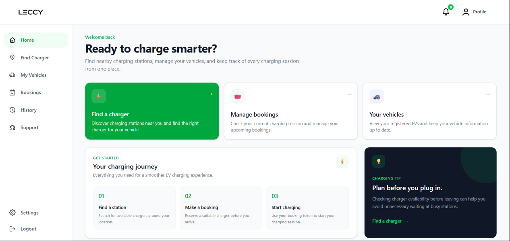
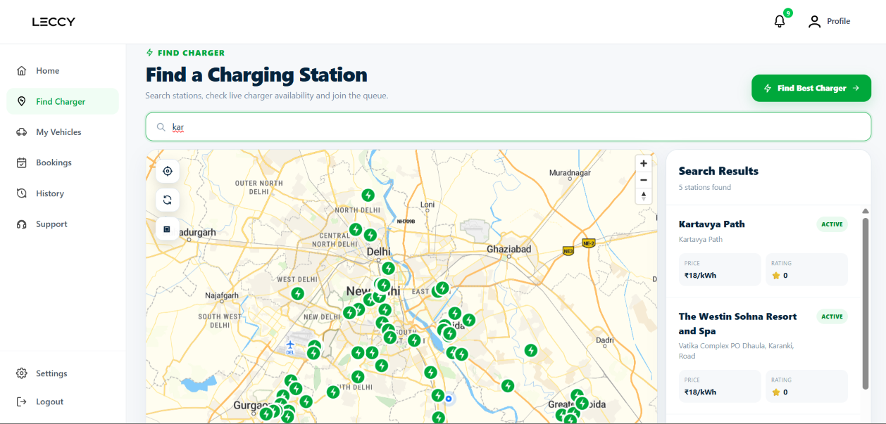
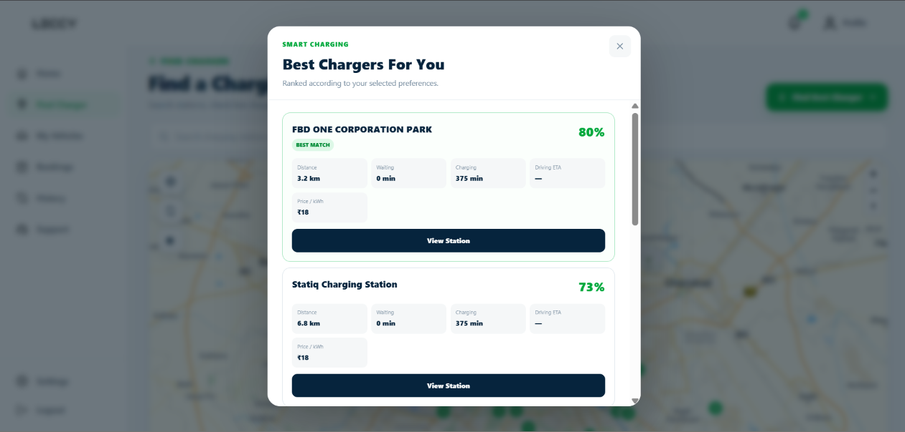
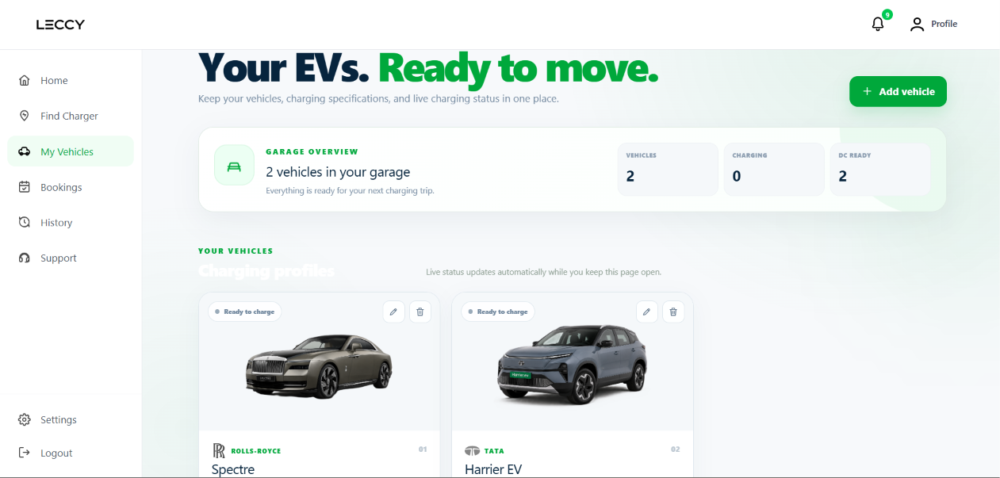
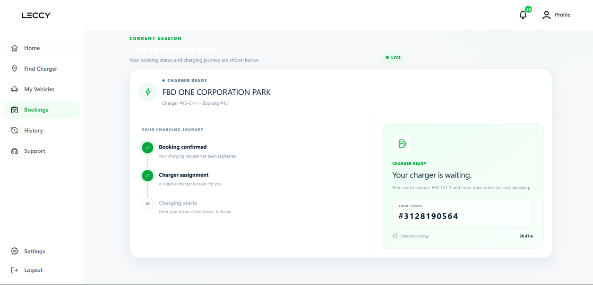
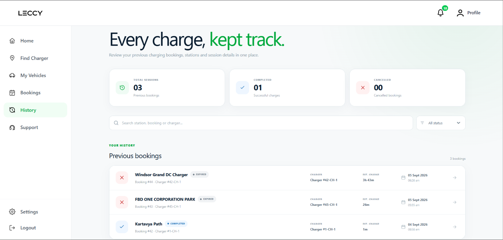
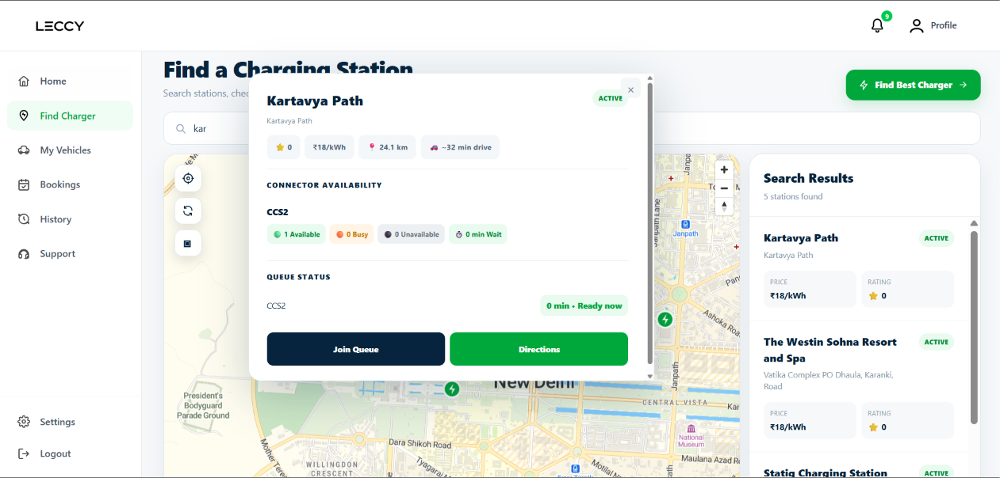
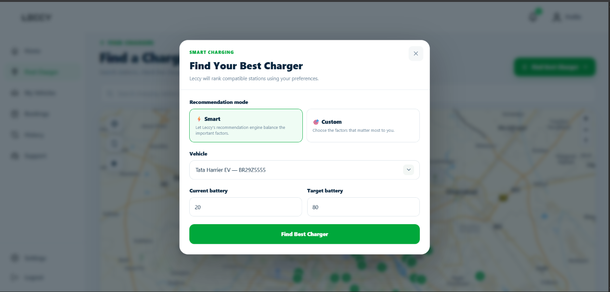
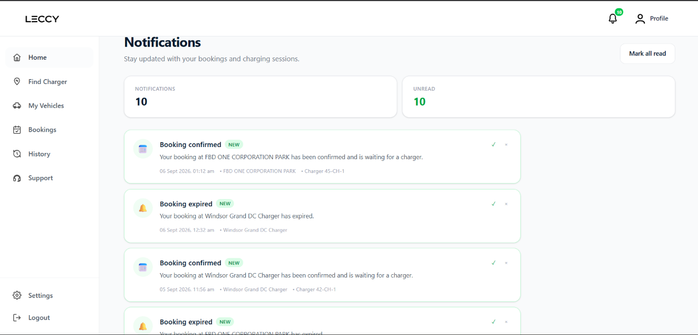

# ⚡ Leccy

> A full-stack EV charging platform for discovering real-world charging
> stations, finding compatible charging options, receiving intelligent
> recommendations, and managing booking and charging-session workflows.

[Features](#features) · [Screenshots](#screenshots) ·
[Architecture](#architecture) · [Tech Stack](#tech-stack) ·
[Setup](#setup) · [Roadmap](#roadmap)

---

## 📸 Screenshots

| Home | Find Charger |
|---|---|
|  |  |

| Smart Recommendations | Vehicles |
|---|---|
|  |  |

| Booking | History |
|---|---|
|  |  |

<details>
<summary>More screenshots</summary>







</details>

---

## 🚗 Features

- **Charging Station Discovery** — Search real-world charging stations
  and explore charger information on an interactive map.
- **EV Compatibility** — Match vehicles with compatible charger types.
- **Smart Recommendations** — Rank charging options based on vehicle,
  battery level, distance, charging time, price and other factors.
- **Booking & Queue Management** — Manage application-level charging
  bookings and queue states.
- **Charging Sessions** — Track the application-managed charging journey.
- **History & Notifications** — Review previous bookings and receive
  booking/session updates.
- **Vehicle Management** — Store and manage EV profiles and specifications.

---

## 🏗️ Architecture

```text
React + Vite
     │
     │ REST API
     ▼
Spring Boot
     │
     ▼
   MySQL